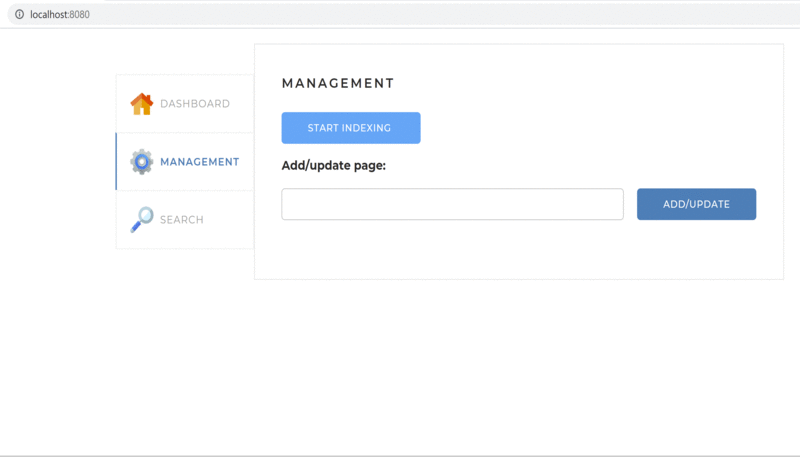

# Java проект - Поисковый движок

Поисковый движок предназначен для поиска по руским и английским словам на сайтах, указанных в конфигурационном файле.
Перед поиском необходимо запустить индексацию сайтов, во время которой будет произведен обход всех страниц сайтов, на каждой странице будут выделены леммы и информация о частоте встречания лемм будет сохранена в базе данных.
После запуска поиска, система находит все подходящие под поисковый запрос страницы, высчитывает их релевантность и выдает в порядке убывания релевантности.



## Стэк используемых технологий

### Бэкенд
- Java Core
- Spring Boot (Spring, Apache Tomcat)
- Hibernate - java библиотека для решения ORM задач, реализация спецификации JPA
- MVC - схема разделения данных приложения
- ForkJoinPool - для многопоточного выполнения рекурсивной задачи
- lucene.morphology - лемматизатор
- MySQL сервер
- MySQL Workbench - программа для работы с базой данных
- SQL - язык запросов, использование индекса
- Стандарт REST
- Формат JSON
- Протокол HTTP
- JSOUP - библиотека для работы с HTML
- Клиент-серверная архитектура приложения
- Lombok - библиотека для сокращения кода в Java
- Git, GitHub - система контроля версий 
- Maven - сборщик проектов 
- IntelliJ IDEA - среда разработки

В рамках данного проекта была разработана бэкенд часть, фронтэнд изначально был предоставлен.

### Фронтэнд
- HTML, CSS, JavaScript
- Шаблонизатор Thymeleaf

## Инструкция по запуску проекта
- Убедиться, что подтянулись все зависимости
- Проверить настройки подключения к бд
- Проверить/добавить сайты для индексации в конфигурационный файл
- Запускаем приложение src/main/java/searchengine/Application.java
- Приложение доступно в браузере по ссылке http://localhost:8080/

Каждый из пунктов рассмотрен подробнее ниже.

### Зависимости

Для успешного скачивания и подключения к проекту зависимостей
из GitHub необходимо настроить Maven конфигурацию в файле `settings.xml`.

А зависимостях, в файле `pom.xml` добавлен репозиторий для получения
jar файлов:

```xml
<repositories>
  <repository>
    <id>skillbox-gitlab</id>
    <url>https://gitlab.skillbox.ru/api/v4/projects/263574/packages/maven</url>
  </repository>
</repositories>
```

Так как для доступа требуется авторизации по токену для получения данных из
публичного репозитория, для указания токена, найдите файл `settings.xml`.

* В Windows он располагается в директории `C:/Users/<Имя вашего пользователя>/.m2`
* В Linux директория `/home/<Имя вашего пользователя>/.m2`
* В macOs по адресу `/Users/<Имя вашего пользователя>/.m2`

>**Внимание!** Актуальный токен, строка которую надо вставить в тег `<value>...</value>`
[находится в документе по ссылке](https://docs.google.com/document/d/1rb0ysFBLQltgLTvmh-ebaZfJSI7VwlFlEYT9V5_aPjc/edit?usp=sharing).

и добавьте внутри тега `settings` текст конфигурации:

```xml
<servers>
  <server>
    <id>skillbox-gitlab</id>
    <configuration>
      <httpHeaders>
        <property>
          <name>Private-Token</name>
          <value>token</value>
        </property>
      </httpHeaders>
    </configuration>
  </server>
</servers>
```

**Не забудьте поменять токен на актуальный!**

❗️Если файла нет, то создайте `settings.xml` и вставьте в него:

```xml
<settings xmlns="http://maven.apache.org/SETTINGS/1.0.0"
          xmlns:xsi="http://www.w3.org/2001/XMLSchema-instance"
          xsi:schemaLocation="http://maven.apache.org/SETTINGS/1.0.0
 https://maven.apache.org/xsd/settings-1.0.0.xsd">

  <servers>
    <server>
      <id>skillbox-gitlab</id>
      <configuration>
        <httpHeaders>
          <property>
            <name>Private-Token</name>
            <value>token</value>
          </property>
        </httpHeaders>
      </configuration>
    </server>
  </servers>

</settings>
```

**Не забудьте поменять токен на актуальный!**

После этого, в проекте обновите зависимости (Ctrl+Shift+O / ⌘⇧I) или
принудительно обновите данные из pom.xml.

Для этого вызовите контекстное меню у файла `pom.xml` в дереве файла проектов **Project** и выберите пункт меню **Maven -> Reload Project**.


⁉️ Если после этого у вас остается ошибка:

```text
Could not transfer artifact org.apache.lucene.morphology:morph:pom:1.5
from/to gitlab-skillbox (https://gitlab.skillbox.ru/api/v4/projects/263574/packages/maven):
authentication failed for
https://gitlab.skillbox.ru/api/v4/projects/263574/packages/maven/russianmorphology/org/apache/
    lucene/morphology/morph/1.5/morph-1.5.pom,
status: 401 Unauthorized
```

Почистите кэш Maven. Самый надежный способ, удалить директорию:

- Windows `C:\Users\<user_name>\.m2\repository`
- macOs `/Users/<user_name>/.m2/repository`
- Linux `/home/<user_name>/.m2/repository`

где `<user_name>` - имя пользователя под которым вы работаете.

После этого снова попробуйте обновить данные из `pom.xml`

### Настройки подключения к БД

В проект добавлен драйвер для подключения к БД MySQL. Для запуска проекта,
убедитесь, что у вас запущен сервер MySQL 8.x.

Перед запуском приложения создайте бд `search_engine` и замените логин и пароль в файле конфигурации `application.yaml`:

```yaml
spring:
  datasource:
    username: root # имя пользователя
    password: root # пароль пользователя
```

### Заполнение конфигурационного файла сайтами для индексации
В конфигурационом файле `application.yaml` укажите сайты для индексации аналогично примеру

```yaml
indexing-settings:
  sites:
  - url: https://www.skillbox.ru
    name: Skillbox
  - url: https://www.playback.ru
    name: PlayBack.Ru
```

После этого, можете запустить проект. Если введены правильные данные,
проект успешно запуститься. Если запуск заканчивается ошибками, изучите текст
ошибок, внесите исправления и попробуйте заново.

## Спецификация API
- Запуск полной индексации **GET /api/startIndexing**
- Остановка текущей индексации **GET /api/stopIndexing**
- Добавление или обновление отдельной страницы **POST /api/indexPage**
- Получить статистику по индексации **GET /api/statistics**

## Описание веб-интерфейса
После запуска приложения, его веб-интерфейс доступен браузере по ссылке http://localhost:8080/
- На вкладке **DASHBOARD** отображается текущий статус индексации. Для каких сайтов из конфигурационного файла была запущена индексация, сколько страниц на каждом сайте и сколько лемм найдено, также статус индексации по всем сайтам и ошибки индексации можно посмотреть на текущей вкладке.
- На вкладке **MANAGEMENT** можно запустить полную индексацию, нажав на кнопку **START INDEXING**.
- Также на вкладке **MANAGEMENT** можно добавить или обовить индекс по отдельной странице, нажав на кнопку **ADD/UPDATE**, но сайт этой страницы должен быть указан в конфигурационном файле.
- На вкладке **SEARCH** можно запускать поисковые запросы по всем проиндексированным сайтам или по конкретному сайту.
